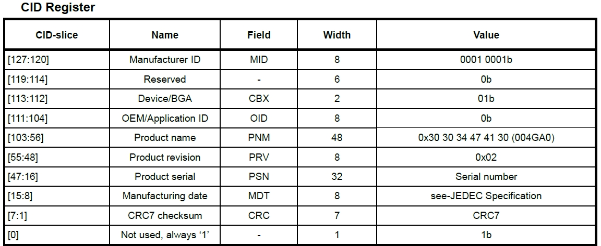
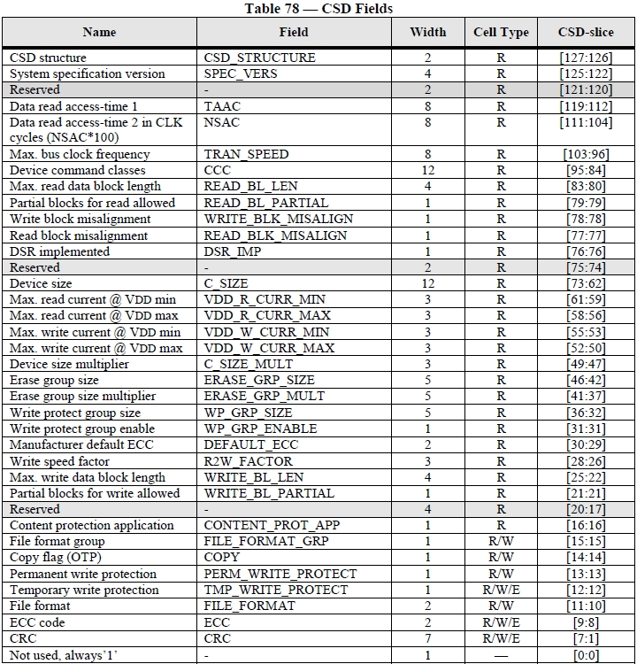
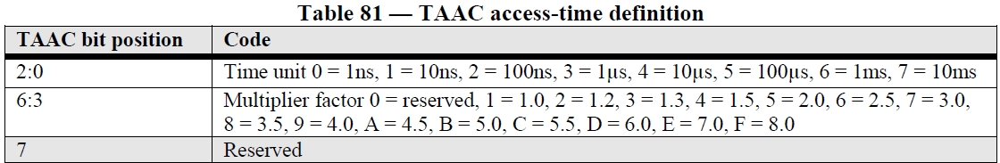
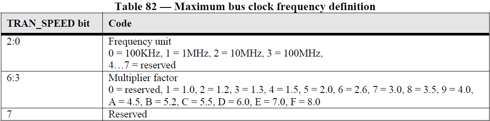
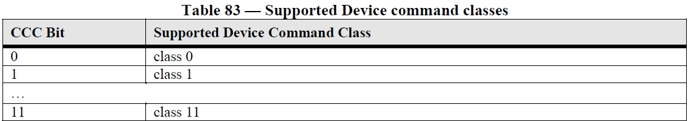
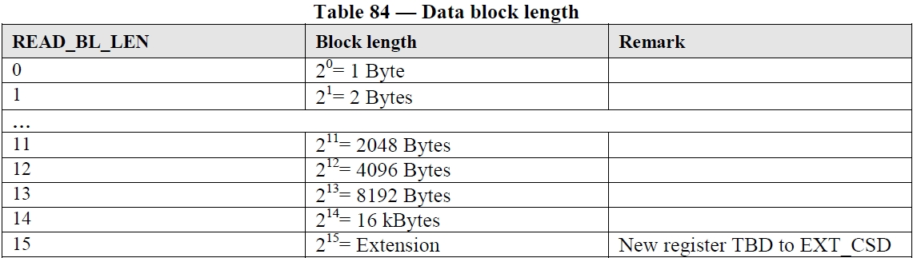
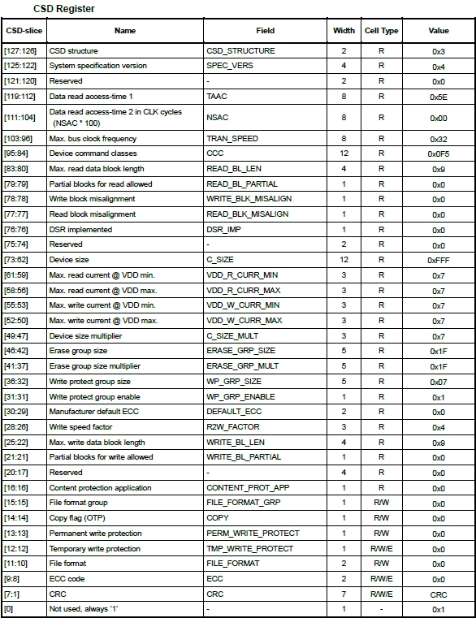

# Common Responses

The eMMC standard defines that all response lengths depend on the response type, and the format of each response varies slightly. eMMC supports five response types, which are generally used to return corresponding register contents. The standard defines several fixed device registers:

| Name | Acronym | Width | Description | Implementation |
| :--- | :--- | :--- | :--- | :--- |
| Card Identification | CID | 128 bits | Unique identifier for each device | Mandatory |
| Relative Card Address | RCA | 16 bits | Relative device address, dynamically allocated during initialization | Mandatory |
| Driver Stage Register | DSR | 16 bits | Configures device output drivers to adapt to different electrical characteristics | Optional |
| Card Specific Data | CSD | 128 bits | Device-specific data containing device operating conditions such as read/write speed, block size, etc. | Mandatory |
| Operation Conditions Register | OCR | 32 bits | Used in broadcast commands to identify device voltage types | Mandatory |
| Extended Card Specific Data | EXT_CSD | 512 bytes | Extended device-specific data, actual device configuration, etc. | Mandatory |

## Normal Response Command (R1/R1b)
Returns the device status. **R1b** can optionally send a busy signal on the data line.

| Field | Start bit | Transmission bit | Command index | Device status | CRC7 | End bit |
| :--- | :--- | :--- | :--- | :--- | :--- | :--- |
| **Position** | [47] | [46] | [45:40] | [39:8] | [7:1] | [0] |
| **Length** | 1 bit | 1 bit | 6 bits | 32 bits | 7 bits | 1 bit |
| **Value** | `0` | `0` | Sequence number of the responded command | See definition table | `x` | `1` |

### Common Device Status Bits

| Position | Identifier | Type | Meaning | Value | Clear Condition |
| :--- | :--- | :--- | :--- | :--- | :--- |
| **[23]** | COM_CRC_ERROR | E R | Previous command CRC check | `0`: No error `1`: Error | B |
| **[22]** | ILLEGAL_COMMAND | E R | Legality of command for current device state | `0`: Legal `1`: Illegal | B |
| **[19]** | ERROR | E X | Unknown error during operation | `0`: No error `1`: Error | B |
| **[12:9]** | CURRENT_STATE | S R | Current device state | Refer to mode state table | A |
| **[8]** | READY_FOR_DATA | S R | Bus signal | `0`: Not ready `1`: Ready to receive data | A |
| **[5]** | APP_CMD | S R | Device waiting to receive application command | `0`: Not ready to receive `1`: Ready to receive | A |

**Type Definitions:**
* **E:** Error bit
* **S:** Status bit
* **R:** Set based on the actual command response
* **X:** Checked and set during command execution

**Clear Condition Definitions:**
* **A:** According to the device's current state
* **B:** Related to the previous command; cleared upon receiving a valid command

## CID / CSD Register (R2)

Returns CID or CSD contents. CID register content is used in response to commands **CMD2** and **CMD10**. CSD register content is used in response to command **CMD9**.

| Field | Start bit | Transmission bit | Check bits | CID or CSD register include internal CRC7 | End bit |
| :--- | :--- | :--- | :--- | :--- | :--- |
| **Position** | [135] | [134] | [133:128] | [127:1] (CID or CSD [127:1]) | [0] |
| **Length** | 1 bit | 1 bit | 6 bits | 127 bits | 1 bit |
| **Value** | `0` | `0` | `all 1` | `x` | `1` |

The CID contains unchangeable information such as the device manufacturer, device name, serial number, revision, and production year.

The following example illustrates the detailed bit-field layout and typical values of a 128-bit CID register (as specified in Kioxia eMMC datasheets):

The CSD register defines the device's operating conditions, such as data transfer speed, maximum data block length, and supported command classes.

* **Data Read Access-Time-1 (TAAC) [119:112]**: Defines the asynchronous part of the read access time.
* **Data Read Access-Time-2 in CLK cycles (NSAC) [111:104]**: Defines the synchronous part of the read access time (clock-dependent).

* **Max. Bus Clock Frequency (TRAN_SPEED) [103:96]**: Specifies the maximum bus clock frequency when not in high speed mode.

* **Card Command Class (CCC) [95:84]**: Indicates the command classes supported by the device.

* **Max. Read Data Block Length (READ_BL_LEN) [83:80]**: Defines the maximum allocated block length for read operations.

***Note**: For the complete bit-field definitions and remaining parameters of the CSD register, please refer to the specific JEDEC standard specifications.*

The following example illustrates a CSD register configuration (based on Kioxia eMMC datasheets) showing specific values for these key fields:

* **TAAC [119:112]**: Value is `0x5E`, resulting in an asynchronous data read access time of 5 ms.
* **TRAN_SPEED [103:96]**: Value is `0x32`, resulting in a clock frequency when not in high speed mode of 26 MHz.
* **CCC [95:84]**: Value is `0x0F5`, supporting command classes Class 0, 2, 4, 5, 6, and 7.
* **READ_BL_LEN [83:80]**: Value is `0x9`, resulting in a maximum read data block length of 512 bytes.

## Extended CSD Register (EXT_CSD)
Returns EXT_CSD register contents in response to command **CMD8**. Register contents are returned via **DATA0**.

* The upper 320 bytes contain device attribute information, which are read-only registers and cannot be modified by the host.
* The lower 192 bytes reflect the configuration of the device under its current working mode.
* Refer to standard definitions for specific field meanings of EXT_CSD.

## OCR Register (R3)
The OCR content of the eMMC device serves as the response to command **CMD1**.

* eMMC devices support two operating voltage ranges: 1.70 V ~ 1.95 V and 2.7 V ~ 3.6 V.
* Byte access mode is more flexible and efficient, but is limited by the addressing bit limit and cannot access storage space exceeding 2 GB. Sector access uses a sector size of 512 bytes and can support storage capacities up to 256 GB.

| Field | Start bit | Transmission bit | Check bits | Card power up status bit (busy) | Access mode | Reserved | Vccq voltage window (2.7 V ~ 3.6 V) | Vccq voltage window (2.0 V ~ 2.6 V) | Vccq voltage window (1.70 V ~ 1.95 V) | Reserved | Check bits | End bit |
| :--- | :--- | :--- | :--- | :--- | :--- | :--- | :--- | :--- | :--- | :--- | :--- | :--- |
| **Position** | [47] | [46] | [45:40] | [39] (OCR [31]) | [38:37] (OCR [30:29]) | [36:32] (OCR [28:24]) | [31:23] (OCR [23:15]) | [22:16] (OCR [14:8]) | [15] (OCR [7]) | [14:8] (OCR [6:0]) | [7:1] | [0] |
| **Length** | 1 bit | 1 bit | 6 bits | 1 bit | 2 bits | 5 bits | 9 bits | 7 bits | 1 bit | 7 bits | 7 bits | 1 bit |
| **Value** | `0` | `0` | `all 1` | `0`: Not complete `1`: Complete | `00b`: Byte `10b`: Sector | `all 0` | `all 1` | `all 0` | `1` | `all 0` | `all 1` | `1` |

## Fast I/O (R4)
Used as a response to command **CMD39**. Returns the contents of the device RCA register.

| Field | Start bit | Transmission bit | Command index | RCA | Status | Register address | Read register contents | CRC7 | End bit |
| :--- | :--- | :--- | :--- | :--- | :--- | :--- | :--- | :--- | :--- |
| **Position** | [47] | [46] | [45:40] | [39:24] (RCA [31:16]) | [23] (RCA [15]) | [22:16] (RCA [14:8]) | [15:8] (RCA [7:0]) | [7:1] | [0] |
| **Length** | 1 bit | 1 bit | 6 bits | 16 bits | 1 bit | 7 bits | 8 bits | 7 bits | 1 bit |
| **Value** | `0` | `0` | `100111b` | `x` | `x` | `x` | `x` | `x` | `1` |

## Interrupt Request (R5)
Sets the system to enter interrupt mode; used as a response to command **CMD40**.

| Field | Start bit | Transmission bit | Command index | RCA (winning) | Not defined | CRC7 | End bit |
| :--- | :--- | :--- | :--- | :--- | :--- | :--- | :--- |
| **Position** | [47] | [46] | [45:40] | [39:24] (RCA [31:16]) | [23:8] (RCA [15:0]) | [7:1] | [0] |
| **Length** | 1 bit | 1 bit | 6 bits | 16 bits | 16 bits | 7 bits | 1 bit |
| **Value** | `0` | `0` | `101000b` | `x` | `all 0` returned by host | `x` | `1` |
