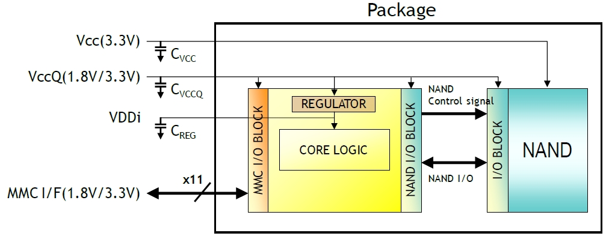

# Electrical Characteristics

This section outlines the power supply constraints, pin configurations, and signal behaviors for eMMC storage devices.

## Power Supply

The system voltage range and the constraint relationship between the core voltage ($V_{cc}$) and the communication voltage ($V_{ccq}$) are shown below. Note that the communication voltage is generally lower than the core voltage.

| Core Voltage (Vcc) \ Communication Voltage (Vccq) | 1.1 V ~ 1.3 V | 1.70 V ~ 1.95 V | 2.7 V ~ 3.6 V |
| :--- | :--- | :--- | :--- |
| **1.70 V ~ 1.95 V** | Valid | Valid | - |
| **2.7 V ~ 3.6 V** | Valid | Valid | Valid |

*Note: The 3.3 V communication voltage range is not supported under HS200 and HS400 speed modes.*

To ensure power stability and signal integrity, external decoupling capacitors must be connected to the power lines (Vcc, Vccq, and the internal regulator output VDDi). The recommended capacitor values and the internal power distribution architecture are illustrated below.

## Pin Definitions

The bus includes a clock line, command line, and data lines. eMMC version 4.5 and later versions added pins such as hardware reset and data strobe.

<table>
  <thead>
    <tr>
      <th>Name</th>
      <th>Type</th>
      <th>Description</th>
    </tr>
  </thead>
  <tbody>
    <tr>
      <td>CLK</td>
      <td>I</td>
      <td>Clock</td>
    </tr>
    <tr>
      <td>DS</td>
      <td>O/PP</td>
      <td>Data strobe (Used in HS400 mode for data synchronization)</td>
    </tr>
    <tr>
      <td>DAT[7:0]</td>
      <td>I/O/PP</td>
      <td>Data</td>
    </tr>
    <tr>
      <td>CMD</td>
      <td>I/O/PP/OD</td>
      <td>Command/Response</td>
    </tr>
    <tr>
      <td>RST_n</td>
      <td>I</td>
      <td>Hardware reset</td>
    </tr>
    <tr>
      <td>VCC</td>
      <td>S</td>
      <td>Supply voltage for Core</td>
    </tr>
    <tr>
      <td>VCCQ</td>
      <td>S</td>
      <td>Supply voltage for I/O</td>
    </tr>
    <tr>
      <td>VSS</td>
      <td>S</td>
      <td>Supply voltage ground for Core</td>
    </tr>
    <tr>
      <td>VSSQ</td>
      <td>S</td>
      <td>Supply voltage ground for I/O</td>
    </tr>
    <tr>
      <td colspan="3"><strong>NOTE</strong> I: input; O: output; PP: push-pull; OD: open-drain; NC: Not connected (or logical high); S: power supply.</td>
    </tr>
  </tbody>
</table>

## Signal Behaviors

* **Clock (CLK)**: Each cycle directs a one-bit transfer on the command line and either a one-bit (1x) or two-bit (2x) transfer on all data lines, with a frequency varying between zero and the maximum clock frequency.
* **Data Strobe**: Generated by the device for output in HS400 mode, this signal follows the CLK frequency and directs a two-bit transfer per cycle (positive and negative edges) for data output, while CRC status and CMD responses are latched on the positive edge only during HS400 enhanced strobe mode.
* **Command Channel (CMD)**: A bidirectional channel used for device initialization and command/response transfers, operating in open-drain mode during initialization and push-pull mode for fast transfers.
* **Data Bus Lines (DAT[7:0])**: Bidirectional channels operating in push-pull mode where only the device or host drives the signals at any given time. The bus defaults to a 1-bit width using DAT0 after power-up or reset, but can be scaled to a 4-bit (DAT0-DAT3) or 8-bit (DAT0-DAT7) width by the host controller.
* **Internal Pull-Up Resistors**: The e•MMC device includes internal pull-ups for lines DAT1–DAT7, which are automatically disconnected by the device upon entering 4-bit mode (for DAT1–DAT3) or 8-bit mode (for DAT1–DAT7).
