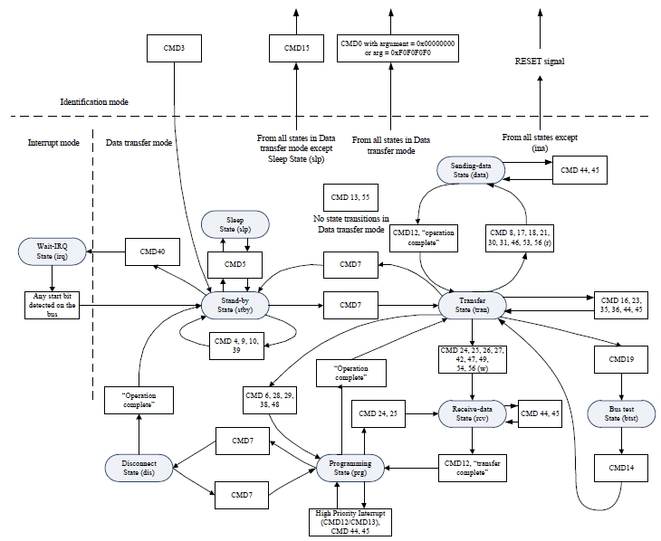

# Operation Workflow

During communication between the host and the device, they may be in different operational modes and states. The entire process can be divided into the **device identification phase** and the **data transfer phase**.

## Mode States

The eMMC standard defines five system operation modes, encompassing both the host and the device. In each operation mode, the device exists in one or more states, transitioned via control commands. The corresponding command line mode may also differ.

<table>
  <thead>
    <tr>
      <th>Operation Mode</th>
      <th>Device State</th>
      <th>Command Line Mode</th>
      <th>Device State Field Encoding</th>
    </tr>
  </thead>
  <tbody>
    <tr>
      <td><strong>Inactive mode</strong></td>
      <td>Inactive state</td>
      <td rowspan="6">Open-drain</td>
      <td>-</td>
    </tr>
    <tr>
      <td rowspan="2"><strong>Boot mode</strong></td>
      <td>Pre-idle state</td>
      <td>-</td>
    </tr>
    <tr>
      <td>Pre-boot state</td>
      <td>-</td>
    </tr>
    <tr>
      <td rowspan="3"><strong>Device identification mode</strong></td>
      <td>Idle state</td>
      <td><code>0000b</code></td>
    </tr>
    <tr>
      <td>Ready state</td>
      <td><code>0001b</code></td>
    </tr>
    <tr>
      <td>Identification state</td>
      <td><code>0010b</code></td>
    </tr>
    <tr>
      <td rowspan="8"><strong>Data transfer mode</strong></td>
      <td>Stand-by state</td>
      <td rowspan="9">Push-pull</td>
      <td><code>0011b</code></td>
    </tr>
    <tr>
      <td>Sleep state</td>
      <td><code>1010b</code></td>
    </tr>
    <tr>
      <td>Transfer state</td>
      <td><code>0100b</code></td>
    </tr>
    <tr>
      <td>Bus-test state</td>
      <td><code>1001b</code></td>
    </tr>
    <tr>
      <td>Sending-data state</td>
      <td><code>0101b</code></td>
    </tr>
    <tr>
      <td>Receive-data state</td>
      <td><code>0110b</code></td>
    </tr>
    <tr>
      <td>Programming state</td>
      <td><code>0111b</code></td>
    </tr>
    <tr>
      <td>Disconnect state</td>
      <td><code>1000b</code></td>
    </tr>
    <tr>
      <td><strong>Boot mode</strong></td>
      <td>Boot state</td>
      <td>-</td>
    </tr>
    <tr>
      <td><strong>Interrupt mode</strong></td>
      <td>Wait-IRQ State</td>
      <td>Open-drain</td>
      <td>-</td>
    </tr>
  </tbody>
</table>

* After power-on, the device can enter **boot mode** or **device identification mode** by receiving specific commands, while the host accesses all devices on the bus. Devices requiring communication enter **data transfer mode** after receiving specific commands, and the host enters **data transfer mode** once all devices on the bus have been identified.
* **Boot mode** can be skipped, it is used to check device health status (such as temperature and voltage) and load configuration information including capacity, sector size, and bad block tables.
* The host and device simultaneously enter and exit **interrupt mode** to service interrupt requests originating from either the device or the host.
* The device enters **inactive state** when its operating voltage or access mode is invalid. The host can also force the device into **inactive state** by sending specific commands, particularly when the device is unaccessed for long periods, to lower power consumption and extend device life.

## Device Identification

After power-on, the host resets or boots all devices, identifies them, and assigns relative card addresses. This entire process uses only the command line for transmission, with a default clock frequency fod of 0 ~ 400 kHz. After power-up or hot insertion, the device enters the **pre-idle state**, and the host starts the clock to send the initialization sequence on the CMD line, ensuring the sequence length covers the required supply-ramp-up-time, boot period, at least 74 clock cycles, or 1 ms.

* If the device supports boot mode and its `BOOT_PARTITION_ENABLE` bit is set, the device moves to the **pre-boot state**. Upon receiving the boot initiation sequence (keeping the CMD line low for at least 74 clock cycles or issuing `CMD0` with argument `0xFFFFFFFA`), the device executes the boot operation, streams data from the boot partition to the host via the data lines, and then enters the **idle state**.
* If the boot sequence is not triggered or the boot partition is disabled, the device moves immediately to the **idle state** post-power-on. While in the **idle state**, the device ignores all bus transactions until `CMD1` is received. 
* The host shall continuously send the synchronization command `CMD1` for up to 1 second to negotiate the operating voltage range and poll the device until its power-up status bit is `1`, indicating startup is complete. If it times out without a valid response, the host closes the bus, causing the device to enter the **inactive state**. When the response `R3` indicates the device is ready, it enters the **ready state**.
* Once startup is complete, the host sends command `CMD2` to obtain the device-unique card identification (CID) via an `R2` response. Unidentified devices compare their CID in real-time, non-matching devices stop sending and remain in the **ready state**, while matching devices enter the **identification state**.
* Afterwards, the host sends command `CMD3` to assign a relative card address (RCA) to the matched device. The RCA is shorter than the CID, making it easier for subsequent addressing in **transfer mode**. Once the RCA is received, the device enters the **stand-by state**, no longer responds to identification flow commands, and switches its output mode from open-drain to push-pull.
* The host repeatedly sends commands `CMD2` and `CMD3` to identify all devices on the bus.

## Data Transfer

Data read and write operations can only be performed when the device is in the **data transfer mode**. Both command and data lines operate in push-pull output mode, and the clock frequency is fpp. Multiple state transition relationships exist between the host and device:

* While in the **stand-by state**, the host can send command `CMD40` to make the device enter **interrupt mode**. When the device receives an internal interrupt event, it returns a response to the host, then switches to **data transfer mode**, awaiting subsequent data read/write commands from the host.
* While in the **stand-by state**, the host can send command `CMD5` to put the device into a low-power **sleep state**. Sending command `CMD5` can similarly cause the device to exit the **sleep state**.
* While in the **stand-by state**, the host can send command `CMD4` to configure the device's DSR register.
* Before acquiring the contents of the device's CSD register, the clock frequency remains at fod. The host can send command `CMD9` and wait for the device to reply with response `R2` to obtain the CSD register contents.
* While in the **stand-by state**, the host can send command `CMD7` to select or deselect a designated device. Devices cannot perform data communication while in the **stand-by state** because multiple devices on the bus may be in **stand-by**, a target device must be selected via its relative card address to enter the **transfer state** before data communication can occur.
* If the version indicated in the returned CSD register contents is greater than 4.0, it denotes a high-speed device supporting commands to operate the `EXT_CSD` register. The host can then send command `CMD8` to retrieve the `EXT_CSD` register contents.
* While in the **transfer state**, the host can send command `CMD6` to configure device attributes such as bus width (`EXT_CSD` reg offset: `0xB7`) and high-speed interface (`EXT_CSD` reg offset: `0xB9`).
* Data communication in **data transfer mode** is conducted point-to-point via addressing commands between the host and the selected device. In the **transfer state**, the host can use block read, block write, and erase commands to perform read/write and erase operations. Specific commands correspond to their respective command categories: block-oriented read commands (class 2), block-oriented write commands (class 4), and erase commands (class 5).
* During transmission, the host can send command `CMD12` to interrupt ongoing data communication, returning the device to the **transfer state**. Commands `CMD0` and `CMD15` will abort any data programming operations and return the device to the **device identification mode**, which may also cause device data corruption.
* The speed at which a device writes to flash is typically lower than the host's data transmission speed. Before data is written to the flash, it is first written to the device buffer. When the buffer is full, the device continuously pulls data line `DATA0` low as a busy signal. Upon receiving the busy signal, the host pauses sending data, resuming transmission only after the device finishes processing the data and releases the busy signal.
* When the device finishes receiving data, it enters the **programming state** to write the remaining data from the internal buffer into the flash. During this process, data line `DATA0` is continuously held low as a busy signal. If a new write command is received before the write is complete, the device returns to the **receive-data state** to accept data, otherwise, it returns to the **transfer state** once the write finishes.
* A device can be reselected while in the **disconnect state**, using `CMD7`. In this case, the device will move to the **programming state** and reactivate the busy indication.
