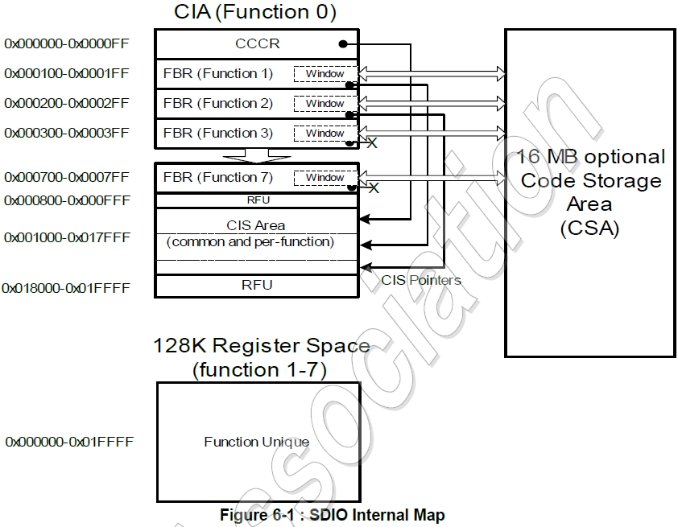

# I/O Card Operation Flow

During communication between the host and the card, they may be in different modes and states. The entire process can be divided into the **device identification phase** and the **data transfer phase**.

## Card Registers

SDIO cards feature a fixed internal register space and functional areas. Fixed positions contain mandatory and optional registers used by the host to obtain card information and execute command operations. All SDIO cards must implement the **Common I/O Area (CIA)**, which is accessed via host I/O read and write operations to **Function 0**. The registers within the CIA provide specific functional implementations and are divided into three register structures:

* **Card Common Control Registers (CCCR)**
* **Function Basic Registers (FBR)**
* **Card Information Structure (CIS)**

## Device Identification

After the card is powered on, the host resets all cards, confirms their voltage ranges, identifies the card types, and obtains their relative card addresses. The entire process uses only the command line. During the power-on process, the default relative card address for all cards is `RCA = 0x0000`, and the default clock frequency fod is 0 ~ 400 kHz.

* After power-on, all cards enter the idle state, at which point the card command line is in input mode, waiting for the transmission of the next command.
* The host first sends command `CMD5` with a parameter of `0`. If no response `R4` is returned, or if the number of functions is `0` and the memory present bit is set, it proceeds with memory card initialization.

* Before receiving command `CMD5` with parameters, the I/O area is in an inactive state. If the host supports UHS-I, it will continuously send command `CMD5` within one second to request switching the signal voltage to 1.8 V. If the card supports UHS-I and the current signal voltage is 3.3 V, the card switches the voltage, sets the corresponding bit, and returns response `R4`. If it is already at 1.8 V, it maintains the voltage, does not set the corresponding bit, and returns response `R4`. The host obtains information such as card-supported functions based on response `R4`.
* If the host fails to receive a response within the timeout period, it should stop sending. Incompatible cards are placed in the inactive state.
* After the I/O portion is initialized, if the card accepts the voltage switch, the host sends command `CMD11` to switch the signal voltage to 1.8 V.
* The host sends command `CMD3` to request the card to issue a new Relative Card Address (RCA) via response `R6`. It is shorter than the Card Identification (CID), making addressing easier in subsequent transfer modes. Once the RCA is received, the card enters the **stand-by state**. During this period, the host can continue sending command `CMD3` to request updated relative card addresses.

## Data Transfer

I/O read/write operations and register access can only be performed when the SDIO card is in the data transfer mode. In data transfer mode, the default clock frequency fpp is up to 25 MHz, and point-to-point communication is established between the host and the target device.

* Command `CMD7` is used to select and deselect specified cards. A card in the stand-by state cannot yet perform I/O communication. A target device with a specific relative card address must be selected to enter the transfer state to enable communication.
* Command `CMD52` is used to read or write a single byte to a specific register across any function space, commonly used for configuring device parameters or checking status flags.
* Command `CMD53` is used to read or write multiple bytes or blocks of data to a register address, supporting byte/block modes and fixed or incrementing address operational codes for high-throughput data transfer.
* Through register access within the CCCR, the host can configure data bus widths (such as switching to 4-bit bus mode) and enable high-speed operation modes.
